## 1、耳常鼓

**针对**：提高听力、记忆力

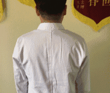

**操作方法**：手掌掩双耳，用力向内压，然后放手，应该有"扑"的一声，重复做10下。

**作用功效**：这动作每天临睡前后做，可以增强记忆和听觉。

## 2、目常运

**针对**：近视、缓解眼睛疲劳

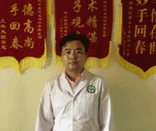

**操作方法**：第一个方法是合眼或闭眼均可，用眼珠转圈，先左、上、右、下顺时针方向转，然后眼珠逆时针转圈，重复3次。第二个方法是搓手36下，将发热的掌心敷在眼部。

**作用功效**：可明目、治疗近视、缓解眼睛疲劳，尤其适用于经常玩手机，视力疲劳的人。

## 3、发常梳

**针对**：头痛、耳鸣

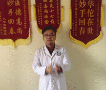

**操作方法**：将双手掌互搓数次，令掌心发热，然后10指向后，由前额开始用手疏头发，经后脑回颈部，早晚各做数次。

**作用功效**：头部有很多重要的穴位，可以明目，预防头痛、耳鸣等。

## 4、齿常叩

**针对**：牙痛、蛀牙

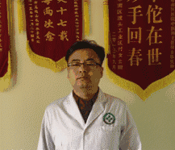

**操作方法**：我们把嘴慢慢的闭上，以此进行叩门齿、每个动作30~50次，但是不要用太大的力气哦，我们在叩门齿的时候必须出声音。

**作用功效**：轻轻的叩，这个动作能够给起到加强肠胃吸收，防止牙痛、蛀牙和牙退化的作用。

## 5、面常洗

**针对**：美容、去皱纹

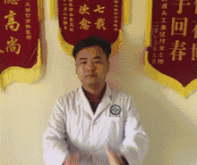

**操作方法**：搓手36下，暖手以后上下扫面。

**作用功效**：这动作经常做，可以令脸色红润有光泽，同时不会有皱纹。

## 6、头常摇

**针对**：颈椎病

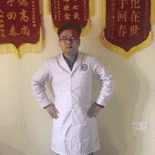

**操作方法**：双手叉腰，闭目，垂下头，缓缓向右扭动，直至恢复原位为一次，共做6次，反方向重复。

**作用功效**：这动作经常做可以令头脑灵活，防止颈椎增生，不过，注意要慢慢做，否则会头晕。

## 7、腰常摆

**针对**：腰痛、腰椎间盘突出

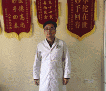

**操作方法**：身体和双手有韵律地摆动。当身体扭向左时，右手在前，左手在后，在前的右手轻轻拍打小腹，在后的左手轻轻拍打命门穴位，反方向重复，最少做50下，做够100下更好。

**作用功效**：这动作可以强化肠胃、固肾气，防止消化不良、胃痛、腰痛、腰椎间盘突出。

## 8、腹常揉

**针对**：便秘、腹胀

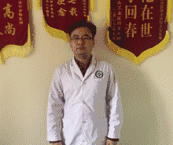

**操作方法**：腹常揉，搓手36下，手暖后两手交叉，围绕肚脐顺时针方向揉，当自己的身体是一个时钟，揉的范围由小到大，做36下。

**作用功效**：这动作可以帮助消化、吸收、便秘、腹胀。

## 9、摄谷道（即提肛）

**针对**：慢性腹泻、男人早泄

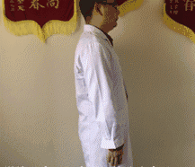

**操作方法**：摄谷道(即提肛) 吸气时提肛，即将肛门的肌肉收紧。闭气，维持数秒，直至不能忍受，然后呼气放松。这动作无论何时都可以练习。最好是每天早晚各做20至30下。相传这动作是乾隆最得意的养生功法。

**作用功效**：本法有升提中气，固精止泄的功效，对慢性腹泻、男子性交时间短有不错的效果。

## 10、漱玉津（玉津即口水）

**针对**：延年益寿、健胃肠

**操作方法**：

（1）口微微合上，将舌头伸出牙齿外，由上面开始，向左慢慢转动，一共转12圈，然后将口水吞下去。之后再由上面开始，反方向再做一下。

（2）口微微合上，这次舌头不在牙齿外边，而在口腔里，围绕上下颚转动。左转12圈后吞口水，然后再反方向做一次。吞口水时，尽量想象将口水带到下丹田。

**作用功效**："唾为肾之液"因此经常做这动作，可以强健肠胃，延年益寿。

## 11、脚常搓

**针对**：失眠、多梦、高血压

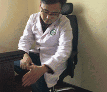

**操作方法**：

（1）右手擦左脚，左手擦右脚。由脚跟向上至脚趾，再向下擦回脚跟为一下，共做36下。

（2）两手大拇指轮流擦脚心涌泉穴，共做100下。

**作用功效**：常做这动作，可以治失眠、降血压、消除头痛。

## 12、膝常扭

**针对**：膝关节疼痛

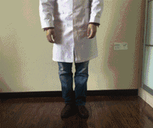

**操作方法**：膝常扭 双脚并排，膝部紧贴，人微微下蹲，双手按膝，向左右扭动，各做20下。

**作用功效**：这动作可以强化膝头关节，对关节炎、骨刺、风湿等膝关节疾病的康复有很好的保健作用。

## 13、常散步

**针对**：助消化、吸收

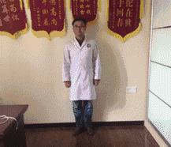

**操作方法**：常散步 挺直胸膛，轻松地散步。最好心无杂念，尽情欣赏沿途景色。民间常说，"饭后走一走，活到九十九"。